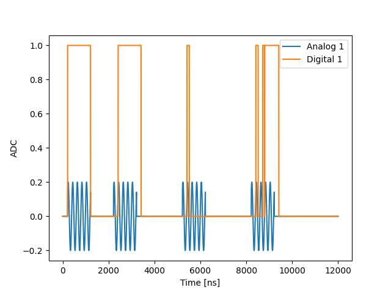

The following example shows usage of a `digital_marker` to enable digital output in sync with
an analog signal. This is useful when, for example, you want to generate a trigger signal to 
another device. 

This is done by configuring the quantum element as in the following snippet, from the configuration file used in this example:
```python
"qe1": {
            "singleInput": {
                "port": ("con1", 1)
            },
            'digitalInputs': {
                'digital_input1': {
                    'port': ('con1', 1),
                    'delay': 0,
                    'buffer': 0,
                },
            },
            'intermediate_frequency': 5e6,
            'operations': {
                'playOp': "constPulse",
            },
        },
```

To make this work, you must also declare the digital output you will be using in the `controller` section of the configuration:
```python
 "con1": {
            'type': 'opx1',
            'analog_outputs': {
                1: {'offset': +0.0},
            },
            'digital_outputs': {
                1: {},
            },
        }
```

####delay and buffer

Note the `delay` and `buffer` keywords in the output configuration. They are explained in more detail in the 
QUA docs, but in this program the action of `delay` is demonstrated by first playing to `qe1` where `delay=144` 
and then to `qe2` where `delay=0`. The digital signal is aligned with the analog signal in the second case but is 
offset by the value of the `delay` parameter in the second. 

####Specifying the digital waveform

The first two signals in the examples use the `ON` digital signal which is defined in the 
`digital_wavforms` section of the configuration. This signal is simply set to be on for the duration 
or the analog signal (up to buffer, see QUA docs). The last two signals use the `trig` and `stutter` waveforms
which are also defined in the same place in the configuration. You can observe and play with the definitions of these
signals to generate arbitrary digital output with 1ns resolution. 



