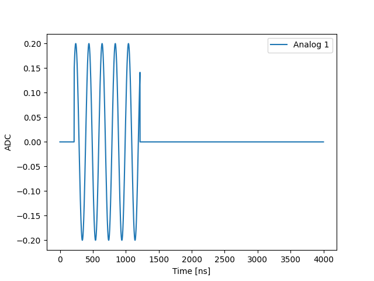

This is the most basic introduction script in QUA. 
It plays a constant amplitude pulse to output 1 
of the OPX and displays the waveform.
  
## Config

The config file declares one quantum element called `qe1`. 
The quantum element has one operation called `playOp`
The `playOp` operation plays a constant amplitude pulse
called `constPulse` which has default duration 1 $\mu S$, 
a frequency of 5 MHz and an amplitude of 0.4V (peak-to-peak).

## Program 

The QUA program simply calls the play command.

We run the program on the simulator for 1000 clock cycles (4000 nS). 

## Post processing

We plot the simulated samples to observe a single cycle of the waveform (1 MHz for 1 micro-second).   
Note the delay (of approx 200nS) between the simulation start and the start of the pulse play.
This delay is faithful to that produced by executing on real hardware. 

## Sample output

## Script

[download script](hello_qua.py)
