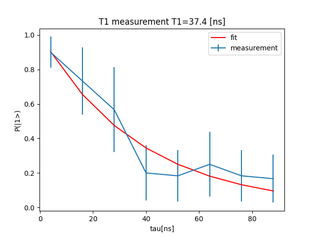

The is a T1 decay time measurement written specifically for the 
superconducting qubit case. 

It plays a $\pi$ pulse to rotate the qubit into the excited state 
and then reads out the state using the readout resonator.
 
## config

The configuration dictionary is in the `configuration.py` file and is imported into the main program file 
`t1.py`. 
 
The configuration defines two elements: `qubit` and `rr` (the readout
resonator). 

The `qubit` quantum element defines the qubit we are measuring. The OPX is connected to 
a mixer via two analog output channels of the OPX, numbered 1 and 2. We also 
specify the LO frequency received by the mixer using the `lo_frequency` field of the `mixInputs`
dictionary, and a mixer correction matrix using the `mixer` field. 

The `qubit` element defines a single operation: `X` which plays a gaussian pulse to the 
I channel of the OPX - producing a rotation of the qubit about the X axis. 
This, of course, must be calibrated to product a proper $\pi$ pulse, e.g. with a 
Time-Rabi experiment.

The `rr` quantum element allows to measure the qubit state by measuring the resonant
I and Q components of a reflected microwave signal.
It defines a `readout` pulse which is read on input number 1 of the OPX, 
as set by the `output` entry of the `rr` element dictionary.
Note also the `time_of_flight` and `smearing` parameters which must 
be defined to perform a measurement. As for the `qubit` we define the associated
`lo_frequency` and `mixer` correction. 

> ⚠️Note that failing to declare a `digital_marker` will not fail program compilation, 
but will prevent data from being acquired. 

## program 

The QUA program `T1` is built around two nested `for_` loops. The external 
loop is used for repeated averaging stesp and the internal loop scans the parameter `tau`.
The body of the loops plays the `X` operation to rotate the qubit into the `|1>` 
state. The `wait` statement is then used with a variable duration `tau`, followed by 
a measurement statement demodulating the readout into the `I` and `Q` variables. 
Each loop ends by a `wait` statement.
The program ends by a `recovery_delay` period which is assumed to be sufficient 
to allow qubit to decay back in the ground state.  

We run the program on the simulator for 500 clock cycles and 
take the simulated samples from the simulation job.

The acquired ADC stream is taken from `result_handles`. 
Note the change of name of the raw ADC steam from the name 
we specified in the program (`raw_adc`) to the name we use to 
get the stream (`raw_adc_input1`). This is an idiosyncrasy of the
raw ADC interface which doesn't not appear in other QUA data saving 
mechanisms.
   
## post processing

To get an estimate of the probability to be in the excited state as a function of delay duration, 
we need to reshape the output streams and calculate the statistics: mean and variance of the 
probability to be in the excited state.

For the sake of the simulation, we define a function called `estimate_state` which returns 
a `1` or `0` with a probability exponentially decaying with the `tau` value. 
We then perform the required operations for estimating the mean and variance, 
plotting the results and estimating the T1 time (that was put in by hand).

This is a convenient starting point for integrating with a custom system-specific procedure.

## Sample output

## Script

[download script](t1.py)
 